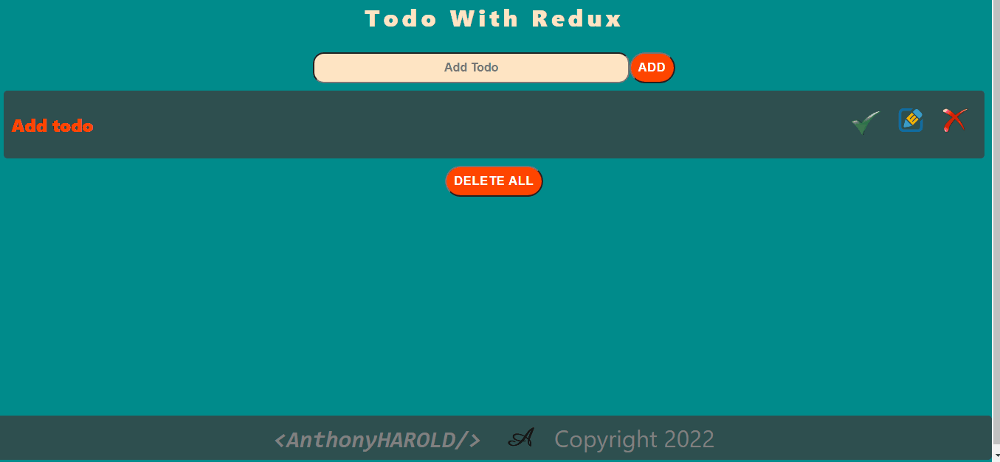

# Todo With Redux   

## Description

Project aims to create a Todo With Redux.

## Problem Statement

- We are adding a new project to our portfolios. So you and your colleagues have started to work on the project.

## Project Skeleton

```
Todo With Redux    
|
|----readme.md         
├── public
│     └── index.html
├── src
│    ├── assets
│    │       └── [images]
│    ├── components
│    │       ├── footer
│    │       |      ├── Footer.jsx
│    │       |      └── Footer.css
│    │       ├── todo
│    │       |      ├── Todo.js
│    │       |      └── Todo.css    
│    │       |      └── TodoList.js
│    │       |      └── TodoInput.js
│    │       |      └── TodoItem.js
│    ├── redux
│    │       ├── actions
│    │       |      └── todoActions.js
│    │       ├── types
│    │       |      └── todoTypes.js
│    │       ├── reducer
│    │       |      └── todoReducer.js
│    │       ├── index.js
│    ├── App.js
│    ├── App.css
│    ├── index.js
│    └── index.css
├── package.json
```

## Expected Outcome



## Objective

Build a Todo With Redux using ReactJS,Redux.